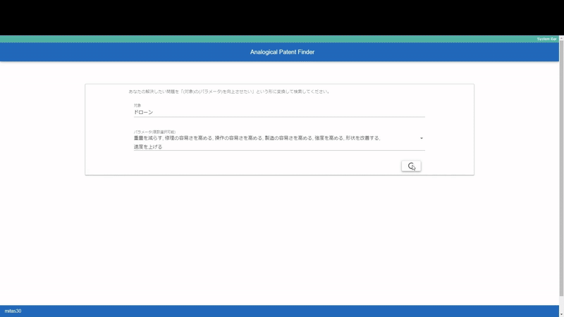

# AnalogyPatentFinder

**Function × Parameter で他分野特許を探し、LLMで発想用カードに変換する設計アナロジー支援ツール**

## 概要
AnalogyPatentFinder は、自分の技術課題を `<flow に対して function するもの> の <parameter> を上げる` という構造に分解し、同じ `function × parameter` を持つ特許を検索する。
検索結果は、特許原文ではなく「課題と背景」「解決策」「応用先」のカードとして提示する。

> 解決策の自動転用ツールではない。  
> 人間が他分野の解決策を自分の問題へ写像するための **source patent** を探すツール。

## Status

- Prototype
- アノテーション済み特許データセットは未同梱
- ローカル起動は可能
- 検索体験の再現には別途データ投入が必要

---

## デモ動画



https://github.com/user-attachments/assets/57123fa9-611a-4b85-8982-6007a24e1810

---

## 誰のどんな行為を変えるか

対象ユーザー:

- 研究開発者
- 製品設計者
- 発明・アイデア出しを行うエンジニア
- TRIZや特許を発想支援に使いたい人
- 特許を読むコストを下げつつ、技術的なヒントを得たい人

変える行為:

| Before | After |
|---|---|
| キーワードで同じ業界の特許を探す | `function × parameter` で異分野の特許を探す |
| 長い特許文書を1件ずつ読む | LLMカードで「使えそうか」を先に判断する |
| 特許を権利文書・先行技術調査として読む | 特許を他分野の問題解決事例として読む |
| 異分野転用を偶然や経験に頼る | 同じ問題構造を持つ source patent から発想する |

このツールの焦点は、特許検索そのものではなく、**特許を発想材料として読む行為**にある。

---

## 既存の方法の難しさ

### キーワード検索の難しさ

既存の特許検索は、キーワードや分類コードを使って、同じ分野・近い用途・近い対象物の特許を探すことに向いている。

一方で、発想のヒントとして欲しいのは、必ずしも同じ分野の特許ではない。  
むしろ、対象物や業界は違っていても、問題の構造が似ている特許が役に立つことがある。

例えば、自分の課題が「ある flow を control する人工物の safety を上げる」問題なら、同じ製品名や同じ業界の特許だけでなく、別分野で同じ `function × parameter` を扱っている特許もヒントになり得る。

しかし、キーワード検索では、このような「分野は遠いが、問題構造が似ている」特許を検索条件として表現しにくい。  

### 特許文書を読む難しさ

特許文書は長く、専門用語が多い。
発想材料として読む場合でも、最初に読むべき箇所が分かりにくい。

特に異分野特許では、次の判断に時間がかかる。

- 何の課題を解いているのか
- なぜその課題が発生するのか
- どんな解決策を使っているのか
- 自分の問題に写像できる考え方があるのか

### LLM単体の難しさ

LLMに直接アイデアを出させると、実在する技術事例との接続が弱くなる可能性がある。

AnalogyPatentFinder は、実在する特許文書を source としつつ、LLMで読みやすいカードに変換する。

---

## 使い方

1. ユーザーが解決したい問題を入力
   - 例: `フィルター` の `信頼性` を上げたい
   - 例: `熱交換器` の `効率性` を上げたい

2. 問題を構造化
   - `flow`
   - `function`
   - `parameter`

3. 同じ `function × parameter` を持つ特許を検索
   - 分野やキーワードが違っても候補に入る
   - 「同じ問題構造を持つ source patent」を優先して提示する

4. 検索結果をカードとして表示(LLMによる専門用語抜きの解説)
   - 解いている課題とその背景
   - 問題の解決策
   - 解決策の応用先

5. 人間が転用可能性を判断
   - 解決策をそのままコピーするのではなく、考え方を自分の問題へ写像する
   - 使えそうな特許だけ原文に戻って詳しく読む

---

## 仕組み

### 基本仮説

同じ `function × parameter` を持つ特許は、同じキーワードでなくても、解決策の考え方を写像しやすい可能性が高い。

この仮説にもとづき、特許を次の2軸で検索する。

| 軸 | 意味 | 出典 |
|---|---|---|
| `function` | 人工物を `<flow に対して function するもの>` と表したときの function。実装上は45の抽象クラスとして扱う | Functional Basis [1] |
| `parameter` | 改善したい性質。実装上はTRIZの39パラメータを使う | TRIZ 39 Parameters [2] |

### LLMの役割

LLMは、解決策の正しさを保証するためではなく、特許を発想材料として読みやすくするために使う。

主な役割:

- 特許文書から課題・背景を要約
- 解決策を短く説明
- 他分野への応用可能性を示す
- ユーザーが原文を読むべきか判断するための前処理

---

## Quick Start

### 1 注意: データセット未同梱

現時点では、公開可能なアノテーション済み特許データセットを同梱していない。
初回起動時のMongoDBは空。

アプリケーションの起動は確認できるが、検索体験を再現するには別途データ投入が必要。

### 2 Requirements

- Docker
- Docker Compose
- Gemini API Key

### 3 Clone

```bash
git clone https://github.com/mitas30/AnalogyPatentFinder.git
cd AnalogyPatentFinder
```

### 4 Configure

`server/config/config_example.json` を `config.json` としてコピー。

```bash
cp server/config/config_example.json server/config/config.json
```

`server/config/config.json` の例:

```json
{
  "GEMINI_API_KEY": "YOUR_GEMINI_API_KEY_HERE",
  "USE_GEMINI_MODEL": "gemini-3-flash-preview"
}
```

Gemini API Key は [Google AI Studio](https://aistudio.google.com/) から取得。
API利用条件・課金設定・送信データの扱いは各自確認。

### 5 Run

```bash
docker compose up --build
```

`docker compose` が使えない環境:

```bash
docker-compose up --build
```

### 6 Open

http://localhost:5173/

---

## 限界と安全上の注意

### 解決策の自動転用ではない

同じ `function × parameter` を持つ特許でも、自分の問題に使えるとは限らない。
最終的な写像・評価・設計判断は人間が行う。

### 特許法的な判断には使えない

このツールは、以下を判断しない。

- 新規性
- 進歩性
- 侵害
- Freedom to Operate
- 権利範囲

必要に応じて、弁理士・専門家に確認。

### LLM出力は誤る可能性がある

LLMカードは、特許原文の要約・加工結果。
重要な限定条件、請求項、実施例、前提条件が抜ける可能性がある。

重要な判断では必ず原文を確認。

### 分類は誤る可能性がある

`function` や `parameter` の分類は候補であり、正解ではない。
分類がずれると、検索結果もずれる。

### 同じ構造でも転用可能性は保証されない

次の条件が違えば、解決策は転用できない可能性がある。

- 材料
- スケール
- 使用環境
- コスト
- 安全規格
- 製造方法
- 法規制
- 既存特許の権利範囲

### 機密情報の入力に注意

外部LLM APIを使う場合、未公開発明、営業秘密、顧客情報、社内機密を入力しない。

---

## Terminology

### Why "Analogy"?

このツールは、アナロジーそのものを完成させるツールではない。

役割は次の3つ:

1. ユーザーの問題を `function × parameter` に抽象化
2. 同じ構造を持つ source patent を検索
3. 人間が写像しやすいカードに変換

つまり、より正確には **analogical patent search** または **design analogy support** のツール。

---

## References
[1] J. Hirtz, R. B. Stone, D. A. McAdams, S. Szykman, and K. L. Wood, “A functional basis for engineering design: Reconciling and evolving previous efforts,” Res Eng Design, vol. 13, no. 2, pp. 65–82, Mar. 2002, doi: 10.1007/s00163-001-0008-3.  
[2] “Appendix I: 39 Parameters of the Contradiction Matrix,” in TRIZ for Engineers: Enabling Inventive Problem Solving, John Wiley & Sons, Ltd, 2011, pp. 468–470. doi: 10.1002/9780470684320.app1.
[3] L. Liu, Y. Li, Y. Xiong, and D. Cavallucci, “A new function-based patent knowledge retrieval tool for conceptual design of innovative products,” vol. 115, Nov. 2019, doi: 10.1016/j.compind.2019.103154.
[4] H. B. Kang, X. Qian, T. Hope, D. Shahaf, J. Chan, and A. Kittur, “Augmenting Scientific Creativity with an Analogical Search Engine,” vol. 29, no. 6, p. 1, Nov. 2022, doi: 10.1145/3530013.
[5] K. Gilon, J. Chan, F. Y. Ng, H. Liifshitz-Assaf, A. Kittur, and D. Shahaf, “Analogy Mining for Specific Design Needs,” Apr. 2018, doi: 10.1145/3173574.3173695.
[6] H. B. Kang et al., “BIOSPARK: An End-to-End Generative System for Biological-Analogical Inspirations and Ideation.”
[7] T. Hope, J. Chan, A. Kittur, and D. Shahaf, “Accelerating Innovation Through Analogy Mining,” Aug. 2017, doi: 10.1145/3097983.3098038.
[8] L. Yu, R. E. Kraut, and A. Kittur, “Distributed Analogical Idea Generation with Multiple Constraints,” Feb. 2016, doi: 10.1145/2818048.2835201.
[9] J. Savelka, K. D. Ashley, M. A. Gray, H. Westermann, and H. Xu, “Can GPT-4 Support Analysis of Textual Data in Tasks Requiring Highly Specialized Domain Expertise?”
[10] L. Yu, A. Kittur, and R. E. Kraut, “Searching for analogical ideas with crowds,” Apr. 2014, doi: 10.1145/2556288.2557378.
[11] L. Yu, A. Kittur, and R. E. Kraut, “Distributed analogical idea generation,” Apr. 2014, doi: 10.1145/2556288.2557371.
